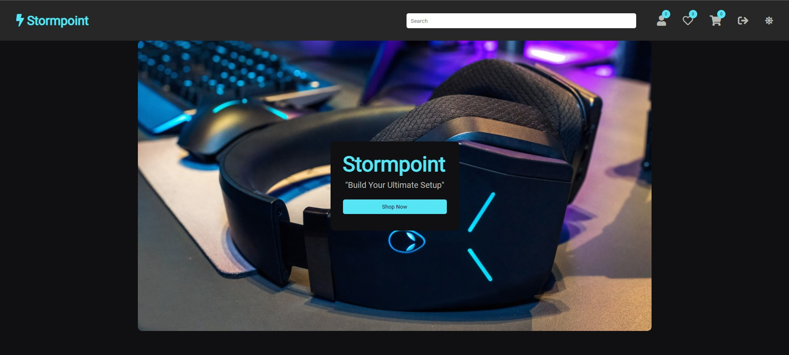

#Welcome To My StormPoint Ecommerce Shop

### Landing Page

You will find the *Landing* page of site on https://stormpoint.netlify.app/

---

### Product Page

You will find the *Products* page of site on https://stormpoint.netlify.app/product-page/product.html

---

### Wishlist Page

You will find the *Wishlist* page of site on https://stormpoint.netlify.app/wishlist-page/wishlist.html

---

### Cart Page

You will find the *Cart* page of site on https://stormpoint.netlify.app/cart-page/cart.html

---

### Login Page

You will find the *Login* page of site on https://stormpoint.netlify.app/login-page/login.html

---

### Signup Page

You will find the *Signup* page of site on https://stormpoint.netlify.app/signup-page/signup.html

---

## 👨‍💻 Connect with me

---

---

Have a look at the implementation of [StormPoint Ecommerce](https://github.com/b0llu/Stormpoint-Ecommerce/tree/developer).

